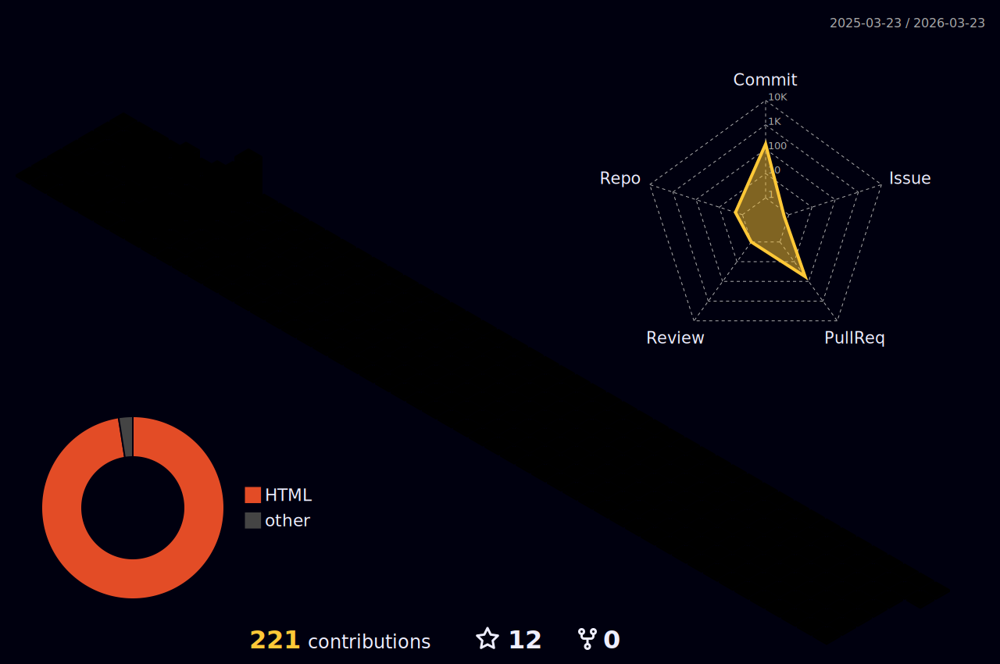

  <h1>Me chamo Matheus Santos Lima!</h1> 
  <h2> * Desenvolvedor FullStack, criador de conteúdo de programação, jogos e tecnologia. *</h2>

   
  
  
 

   
  

   
   
  
## Sobre Mim

Olá! 👋 Sou um desenvolvedor fullstack apaixonado por transformar ideias em soluções digitais eficientes. Tenho experiência em desenvolvimento web criando aplicações robustas e escaláveis com Node.js, TypeScript, React, Firebase e MongoDB, além de explorar ferramentas como Streamlit para interfaces rápidas e intuitivas.

Com uma base sólida em Data Science, utilizo o poder do Python e bibliotecas como Pandas e NumPy para análise de dados, automatização e tomada de decisões orientadas a dados. Também sou hábil no uso de SQL, NoSQL (PostgreSQL, MySQL, SQLite) e ferramentas como Jupyter Notebook e Anaconda para estruturar e explorar informações.

Minhas habilidades em automação de testes complementam minha experiência de desenvolvimento, garantindo a qualidade das aplicações através de ferramentas como Cypress e Jenkins. Foco em práticas como testes exploratórios, de sanidade e em aplicações embutidas para entregar software confiável e eficiente.

Adoro aprender, compartilhar conhecimento e enfrentar novos desafios! 🚀 Meu objetivo é contribuir para projetos impactantes e continuar evoluindo como profissional. Vamos colaborar? 

 

 

|  |  |  
| ----------- | ----------- |

## Github Stats

  
  

<!--
<picture align="center">
  <source media="(prefers-color-scheme: dark)" srcset="https://raw.githubusercontent.com/matheus153/matheus153/output/github-contribution-grid-snake-dark.svg">
  <source media="(prefers-color-scheme: light)" srcset="https://raw.githubusercontent.com/matheus153/matheus153/output/github-contribution-grid-snake-dark.svg">
  
</picture>
>

